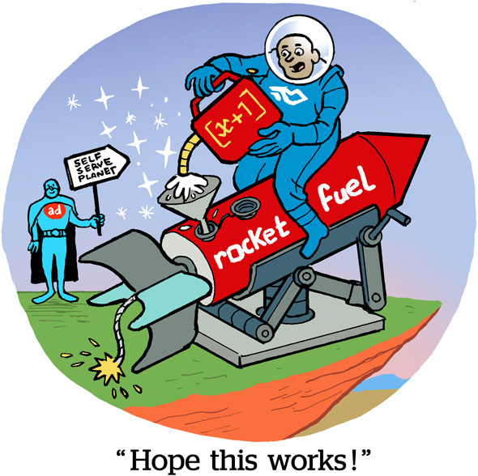
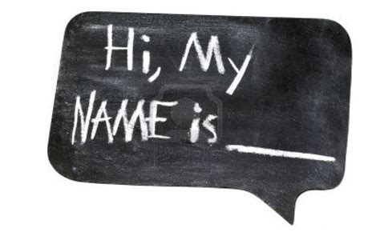

You've all heard the story of how rocket fuel was invented right? No? Really?

Okay, here's the watered down version:

## Rocket Fir...Fuel, Fuel
Some dudes at a US University were playing around with some highly flammable shit and nearly burned their entire school dorm down. Instead of getting expelled, the school administration saw the potential that these these crazy dude had and instead, put them on some remote farm somewhere and told them to keep doing whatever it was that they were doing.


<div align=center>

  

</div>

Now I admit, I don't know exactly how accurate this tale is, but that's not the point. The point is, **someone believed in these dumdums' madness**!. And the rest, as they say, is history.

## Hi, My Name Is...
Scratch the academia example, here's another one that am sure (ish) you've heard. In the late 90's, there was this very well known music producer who was well known for his music production prowess and churning out hit after hit. He worked with the biggest names in the HipHop industry. Yes, ladies and gentlemen, am talking about [Dr. Dre](https://www.drdre.com/). When he signed a little known white rapper, [Eminem](https://www.eminem.com/) everyone thought he was crazy. But that was him believing in Em's madness (although this could've been the literal madness). Everyone thought Dre was mad (did you see that? haha). The [Slim Shady LP](https://en.wikipedia.org/wiki/The_Slim_Shady_LP) dropped and again, history.


<div align=center>



</div>

Okay, I admit, maybe I should change the title to **Have Someone Believe In Your Madness** but then we'd all end up in an asylum because, come-on....you know what I mean?**

## HA-HA-HA...
But we are all crazy, in our own unique ways, and while the world may be short on people who believe in our madness (well, everyone besides psychiatrists), I want to tell you to believe in your own madness. Believe in the mad voice telling you that you can do it, you can learn that new skill and change your career (developers have a mad crowd in their heads telling them to learn all kinds of shit). Just ask Mark, he did, and so can you. With self confidence, belief in your own abilities and hard work, there's nothing you can't do. Just ask the Instagram guys (no, not Mark, the ones before)

## HA-HA-HA...in 3rd person

And if you have the opportunity to propel someone's career or life forward, (yeah, I mean if you're not a psychiatrist and see someone who's madness can profit you), go ahead and give them a chance. Fight for them, forward their names and follow up, because their success is your success too.
So go out there, and change the world.

```
Your's in Madness,

MashMellow
```

## PS
Criminal Insanity ```!=``` to the madness am talking about. Those peeps are crazy (oh, I kill myself, haha).