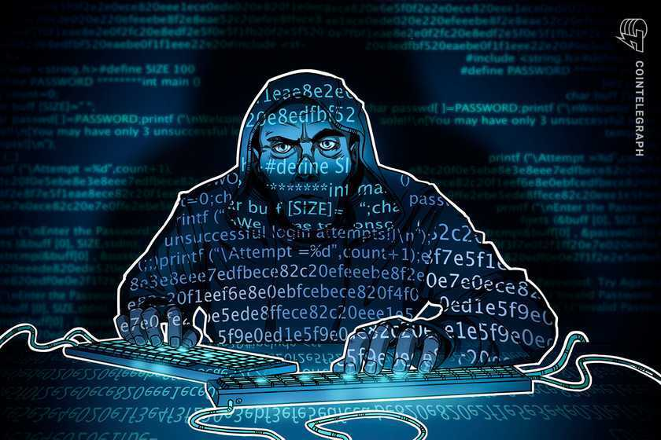

Okay, so it's every geek's wet dream to be in a world like the one Parzival lives in, I know it's mine...well, minus the mega corp that's trying to kill you, haha.

Anyways, I've had this idea that has been swimming in my head and I need to immortalize it lest I forget.

What if we (someone with some real deep pockets, of course) made a video game like Ready Player One but only for...drumrolls please, Hackers!!

I know right?!! Mind blown!!

<div align=center>

  

</div>

Okay, hold on, hold on a minute...I know you're going to quote the games that involve _"hacking"_; CyberPunk 2077, WatchDogs, Recompile and the likes but no..am not talking about the superficial hacking that those games have..am talking about the real stuff, you know, the hands on stuff that we engage in on platforms such as [TryHackMe](https://www.tryhackme.com), [HackTheBox](https://www.hackthebox.eu) and all the rest. 

Now, you're probably asking, why not just use the platforms to learn and hack? Well, first, this is more geared towards the pros, or sem-pros, here's how...

## Exhibit 1
In-game, you need to get into the Tax Department's computers to clear your debt. You run an nmap scan, and a few minutes later, you get a knock on your door, your IP address was identified scanning a protected government agency website..your laptop and all your tech is confiscated and boom, you're screwed, you have to start from scratch...

## Exhibit 2
You have physical access to Company A's site and you need to set up a Raspberry Pi in their network to use as your backdoor so you have to set it up, install all the necessary packages and make sure it's all set up...and you get to your "joint" and run a simple ```ssh root@my-raspi``` and then proceed to scan the network from the Pi. F***ing awesome, right?

## Exhibit 3
You are deep into MegaCorp X's systems, you have achieved RCE, have set up your C2 structure, have pwned a bunch of their users and are headed for their Domain Controller. Then you make one small mistake and boom, they are aware of your presence in their network, so they patch everything and make a report but luckily, you were smart enough to not use your real identity but bummer, you have to start from scratch, but this time, you're up against a fully patched system so you have to find a different way in...Come on, tell me RedTeamers wouldn't love doing what they do but in a virtual world that acts just like this one, minus all the (real) shit...I would be ecstatic!!

<div align=center>
  
</div>

Okay, I admit, writing may not be my forte, but you got the idea, right?

Here's another one i cant go without saying; so , you've achieved RCE on your "home computer" and then the lights go off, BLACKOUT!!! Oh boy, I need to stop this, haha.

## Exhibit 4
You need to phish an employee to obtain their credentials so you call them up, all in-game ofcourse (this would require some super spit shined AI inorder to make the interaction lively and all), but it's all doable...


Now, I admit, this would require infrastructure on a massive scale but there's nothing we can't do..right? Well, besides world peace, I think everything is doable.
